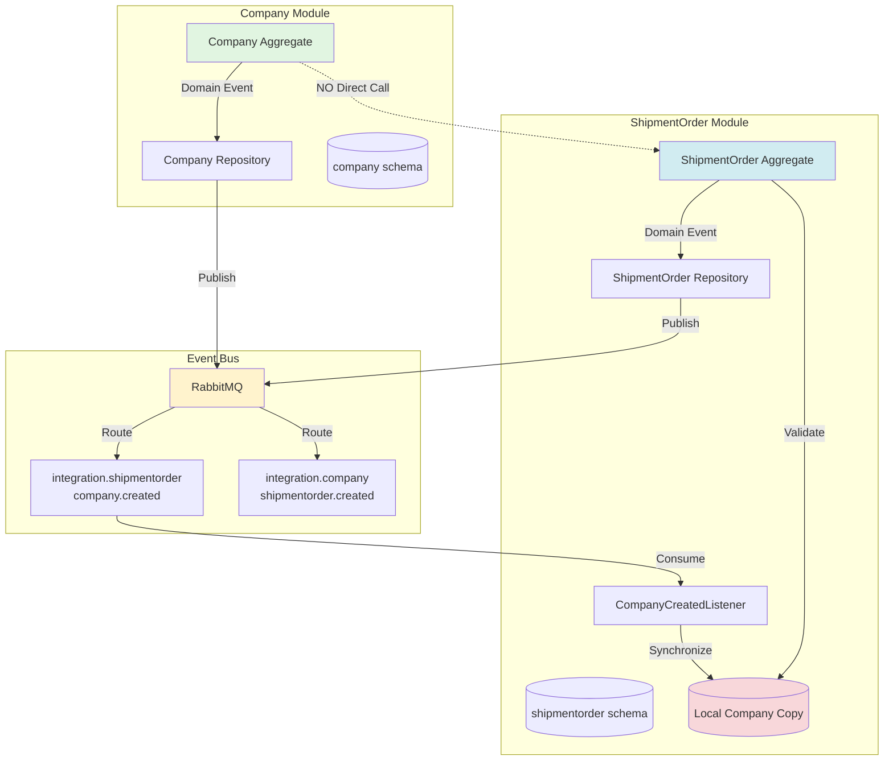

# GitHub Copilot Instructions for TMS

## Quick Context

**Project:** Transportation Management System (TMS)  
**Architecture:** Modular Monolith with DDD, Hexagonal Architecture, CQRS, Event-Driven  
**Tech Stack:** Java 21, Spring Boot 3.x, PostgreSQL, RabbitMQ, Maven  
**Team:** Includes junior developers - prioritize clarity and consistency

---

## 🎯 Quick Decision Tree

**What do you need to do?**

```
CREATE something new?
├─ Aggregate? → Use "Essential Patterns #1" below + /doc/ai/prompts/new-aggregate.md
├─ Use Case? → Use "Essential Patterns #2" below + /doc/ai/prompts/new-use-case.md
├─ Controller? → Use "Essential Patterns #3" below + /doc/ai/prompts/new-controller.md
├─ Value Object? → See /doc/ai/prompts/value-objects.md
├─ Event Listener? → Use "Essential Patterns #6" below + /doc/ai/prompts/new-event-listener.md
├─ Test Infrastructure? → See "Testing Approach" section + .squad/skills/test-infrastructure-patterns/SKILL.md
├─ Integration Test? → See "Testing Approach" section + /doc/ai/INTEGRATION_TESTS.md
├─ Database Migration? → See "Database Migrations" section + /doc/ai/prompts/new-migration.md
├─ HTTP Request File? → See /doc/ai/prompts/http-requests.md
├─ Eventual Consistency? → See /doc/ai/prompts/eventual-consistency.md
├─ Module? → See /doc/ai/prompts/new-module.md
├─ Test Data Builder? → See "Testing Approach" section + .squad/skills/test-infrastructure-patterns/SKILL.md
├─ Fake Repository? → See "Testing Approach" section + .squad/skills/test-infrastructure-patterns/SKILL.md
└─ ArchUnit Test? → See /doc/ai/ARCHUNIT_GUIDELINES.md + /doc/ai/ARCHUNIT_TEST_CATALOG.md

UNDERSTAND a pattern?
├─ Quick lookup? → See sections below or /doc/ai/QUICK_REFERENCE.md
├─ Full architecture? → See /doc/ai/ARCHITECTURE.md
├─ Test structure? → See /doc/ai/TEST_STRUCTURE.md
├─ Integration tests? → See /doc/ai/INTEGRATION_TESTS.md
├─ HTTP testing? → See /doc/ai/prompts/http-requests.md
├─ ArchUnit testing? → See /doc/ai/ARCHUNIT_GUIDELINES.md
├─ Existing tests? → See /doc/ai/ARCHUNIT_TEST_CATALOG.md
└─ Project overview? → See /doc/ai/CODEBASE_CONTEXT.md

REVIEW code?
├─ Check patterns? → Compare against sections below
├─ Validation rules? → See "Critical Rules" and "Anti-Patterns" sections
├─ ArchUnit tests? → See /doc/ai/ARCHUNIT_TEST_CATALOG.md
└─ Examples? → See /doc/ai/examples/
```

---

## 🧠 Available Skills

Squad has extracted reusable patterns as skills. Reference these before implementing:

| Skill | When to Use | Confidence |
|-------|-------------|------------|
| `json-singleton-usage` | Parsing JSON in listeners, serializing events | 🟡 Low |
| `eventual-consistency-pattern` | Cross-module data validation | 🟢 High |
| `fake-repository-pattern` | Unit testing use cases | 🟡 Low |
| `test-data-builder-pattern` | Creating test data with variations | 🟡 Low |
| `immutable-aggregate-update` | Updating aggregates | 🟢 High |
| `archunit-condition-reuse` | Writing ArchUnit tests | 🟡 Medium |
| `test-infrastructure-patterns` | Building complete test infrastructure for entities | 🟢 High |

**Location:** `.squad/skills/{name}/SKILL.md`

---

## Essential Patterns

### 0. Coding Standards (CRITICAL)

**All Variables MUST be Final:**
```java
// ✅ CORRECT
private final CompanyRepository companyRepository;

public UseCase(final CompanyRepository companyRepository) {
    this.companyRepository = companyRepository;
}

public Output execute(final Input input) {
    final Company company = repository.findById(input.id());
    final Map<String, Object> data = new HashMap<>();
    // ...
}

// ❌ WRONG
private CompanyRepository companyRepository;  // Missing final

public UseCase(CompanyRepository companyRepository) {  // Missing final
    this.companyRepository = companyRepository;
}

public Output execute(Input input) {  // Missing final
    Company company = repository.findById(input.id());  // Missing final
    Map<String, Object> data = new HashMap<>();  // Missing final
}
```

**Value Objects for Encapsulation:**
```java
// ✅ CORRECT - Use value objects
private final CompanyId companyId;
private final CompanyData data;

public CompanyId getCompanyId() {
    return companyId;
}

// ❌ WRONG - Raw primitives exposed
private final UUID companyId;
private final Map<String, Object> data;

public UUID getCompanyId() {
    return companyId;
}
```

**JSON Mapping (Hibernate 6):**
```java
// ✅ CORRECT
@JdbcTypeCode(SqlTypes.JSON)
@Column(name = "data")
private Map<String, Object> data;

// ❌ WRONG (old Hibernate)
@Type(JsonBinaryType.class)
@Column(name = "data", columnDefinition = "jsonb")
private Map<String, Object> data;
```

**Factory Method Naming:**
```java
// ✅ CORRECT
public static Company createCompany(UUID id, Map<String, Object> data) {
    return new Company(CompanyId.with(id), CompanyData.with(data), new HashSet<>());
}

// ❌ WRONG
public static Company synchronizeCompany(...)  // Use "create" not "synchronize"
```

**JSON Serialization:**
```java
// ✅ CORRECT - Use JsonSingleton
@SuppressWarnings("unchecked")
final Map<String, Object> data = JsonSingleton.getInstance()
        .fromJson(jsonString, Map.class);

final String json = JsonSingleton.getInstance().toJson(object);

// ❌ WRONG - Don't inject ObjectMapper
private final ObjectMapper objectMapper;  // Never inject this

public Listener(ObjectMapper objectMapper) {  // Don't do this
    this.objectMapper = objectMapper;
}
```

### 1. Use Case Pattern

**WRITE Operation (with all required finals):**
```java
@DomainService
@Cqrs(DatabaseRole.WRITE)
public class CreateCompanyUseCase implements UseCase<CreateCompanyUseCase.Input, CreateCompanyUseCase.Output> {
    
    private final CompanyRepository companyRepository;

    public CreateCompanyUseCase(final CompanyRepository companyRepository) {
        this.companyRepository = companyRepository;
    }

    @Override
    public Output execute(final Input input) {
        // 1. Validation
        if (companyRepository.getCompanyByCnpj(new Cnpj(input.cnpj())).isPresent()) {
            throw new ValidationException("Company already exists");
        }
        
        // 2. Create via aggregate factory method
        final Company company = Company.createCompany(
            input.name(), input.cnpj(), input.types(), input.configuration()
        );
        
        // 3. Persist (repository handles event outbox)
        final Company saved = companyRepository.create(company);
        
        // 4. Return output
        return new Output(saved.getCompanyId().value(), saved.getName());
    }

    public record Input(String name, String cnpj, Set<CompanyType> types, Map<String, Object> configuration) {}
    public record Output(UUID companyId, String name) {}
}
```

**READ Operation:**
```java
@DomainService
@Cqrs(DatabaseRole.READ)
public class GetCompanyByIdUseCase implements UseCase<GetCompanyByIdUseCase.Input, GetCompanyByIdUseCase.Output> {
    
    private final CompanyRepository companyRepository;

    public GetCompanyByIdUseCase(final CompanyRepository companyRepository) {
        this.companyRepository = companyRepository;
    }

    @Override
    public Output execute(final Input input) {
        final Company company = companyRepository.getCompanyById(new CompanyId(input.companyId()))
                .orElseThrow(() -> new NotFoundException("Company not found"));

        return new Output(company.getCompanyId().value(), company.getName(), company.getCnpj().value());
    }

    public record Input(UUID companyId) {}
    public record Output(UUID companyId, String name, String cnpj) {}
}
```

**Key Points:**
- ✅ Annotate with `@DomainService` + `@Cqrs(DatabaseRole.WRITE or READ)`
- ✅ Input/Output as nested records
- ✅ Constructor injection only, ALL parameters and variables `final`
- ✅ One operation per use case

**Full details:** See `doc/ai/examples/complete-use-case.md` and `doc/ai/prompts/new-use-case.md`

---

### 2. REST Controller Pattern

```java
@RestController
@RequestMapping("companies")
@Cqrs(DatabaseRole.WRITE)
public class CreateController {

    private final CreateCompanyUseCase createCompanyUseCase;
    private final DefaultRestPresenter defaultRestPresenter;
    private final RestUseCaseExecutor restUseCaseExecutor;

    public CreateController(final CreateCompanyUseCase createCompanyUseCase,
                           final DefaultRestPresenter defaultRestPresenter,
                           final RestUseCaseExecutor restUseCaseExecutor) {
        this.createCompanyUseCase = createCompanyUseCase;
        this.defaultRestPresenter = defaultRestPresenter;
        this.restUseCaseExecutor = restUseCaseExecutor;
    }

    @PostMapping
    public Object create(@RequestBody final CreateCompanyDTO dto) {
        return restUseCaseExecutor
                .from(createCompanyUseCase)
                .withInput(dto)
                .mapOutputTo(CreateCompanyResponseDTO.class)
                .presentWith(output -> defaultRestPresenter.present(output, HttpStatus.CREATED.value()))
                .execute();
    }
}
```

**Key Points:**
- ✅ Zero business logic - only delegation
- ✅ Use `RestUseCaseExecutor` for orchestration
- ✅ DTOs for request/response
- ✅ Must have `@Cqrs` annotation
- ✅ ALL constructor parameters and method parameters must be `final`

**Full details:** See `doc/ai/examples/complete-controller.md` and `doc/ai/prompts/new-controller.md`

---

### 3. Immutable Aggregate Pattern

```java
public class Company extends AbstractAggregateRoot {
    private final CompanyId companyId;
    private final String name;
    private final Cnpj cnpj;
    // ... (other fields)
    
    // Private constructor
    private Company(/* all params final */) {
        super(new HashSet<>(domainEvents), new HashMap<>(persistentMetadata));
        // Validation...
        this.companyId = companyId;
        // ... (field assignments)
    }
    
    // Factory method
    public static Company createCompany(...) {
        Company company = new Company(CompanyId.unique(), ...);
        company.placeDomainEvent(new CompanyCreated(...));
        return company;
    }
    
    // Update returns NEW instance
    public Company updateName(String name) {
        if (this.name.equals(name)) return this;
        Company updated = new Company(this.companyId, name, ...);
        updated.placeDomainEvent(new CompanyUpdated(...));
        return updated;
    }
    
    // Getters only
    public CompanyId getCompanyId() { return companyId; }
}

// Full implementation: doc/ai/examples/complete-aggregate.md
// Pattern guide: .squad/skills/immutable-aggregate-update/SKILL.md
```

**Key Points:**
- ✅ ALWAYS immutable - updates return new instances
- ✅ Private constructor + public factory methods
- ✅ Domain events placed HERE, not in use cases
- ✅ Getters only, NO setters
- ✅ ALL parameters must be `final`

**Full details:** See `.squad/skills/immutable-aggregate-update/SKILL.md` and `doc/ai/examples/complete-aggregate.md`

---

### 4. Value Object Pattern

**Simple validated value object:**
```java
public record Cnpj(String value) {
    public Cnpj {
        if (value == null || !isValid(value)) {
            throw new ValidationException("Invalid CNPJ format");
        }
    }
    
    private static boolean isValid(final String cnpj) {
        return cnpj != null && cnpj.matches("\\d{14}");
    }
}
```

**ID value object (typical pattern):**
```java
public record CompanyId(UUID value) {
    public CompanyId {
        if (value == null) {
            throw new ValidationException("CompanyId cannot be null");
        }
    }
    
    public static CompanyId unique() {
        return new CompanyId(Id.unique());  // UUID v7
    }
    
    public static CompanyId with(final UUID value) {
        return new CompanyId(value);
    }
}
```

**Key Points:**
- ✅ Use Java `record`
- ✅ Validation in compact constructor
- ✅ Immutable by nature
- ✅ ID value objects use `Id.unique()` for UUID v7 generation

**Full details:** See `doc/ai/prompts/value-objects.md`

---

### 5. Domain Event Pattern

```java
public class CompanyCreated extends AbstractDomainEvent {
    private final UUID aggregateId;
    private final String payload;

    public CompanyCreated(final UUID aggregateId, final String payload) {
        super(Id.unique(), aggregateId, Instant.now());
        this.aggregateId = aggregateId;
        this.payload = payload;
    }

    public UUID getAggregateId() { return aggregateId; }
    public String getPayload() { return payload; }
}
```

**Key Points:**
- ✅ Past tense naming (Created, Updated, Deleted)
- ✅ Always include aggregateId
- ✅ Place in aggregate methods via `placeDomainEvent()`
- ✅ Use `Id.unique()` for event ID (UUID v7)
- ✅ ALL constructor parameters must be `final`

**Full details:** See `doc/ai/examples/event-driven-communication.md`

---

### 6. Event Listener Pattern (Module Communication)

```java
@Component
@Cqrs(DatabaseRole.WRITE)
@Lazy(false)
public class IncrementShipmentOrderListener {

    private final VoidUseCaseExecutor voidUseCaseExecutor;
    private final IncrementShipmentOrderUseCase incrementShipmentOrderUseCase;

    public IncrementShipmentOrderListener(final VoidUseCaseExecutor voidUseCaseExecutor,
                                         final IncrementShipmentOrderUseCase incrementShipmentOrderUseCase) {
        this.voidUseCaseExecutor = voidUseCaseExecutor;
        this.incrementShipmentOrderUseCase = incrementShipmentOrderUseCase;
    }

    @RabbitListener(queues = "integration.company.shipmentorder.created")
    public void handle(final ShipmentOrderCreatedDTO dto, 
                      final Message message, 
                      final Channel channel) {
        voidUseCaseExecutor
                .from(incrementShipmentOrderUseCase)
                .withInput(new IncrementShipmentOrderUseCase.Input(dto.companyId()))
                .execute();
    }
}
```

**Key Points:**
- ✅ Modules communicate ONLY via events
- ✅ Use `@RabbitListener` for inter-module events
- ✅ Never call other module's repositories directly
- ✅ ALL constructor and method parameters must be `final`
- ✅ Use `VoidUseCaseExecutor` for use cases with no output

**Full details:** See `.squad/skills/eventual-consistency-pattern/SKILL.md`, `doc/ai/prompts/new-event-listener.md`, and `doc/ai/examples/event-driven-communication.md`

---

## Database Migrations

**Location:** `/infra/database/migration/`

**Process:**
1. Migrations are versioned SQL files: `V{number}__{description}.sql`
2. Applied automatically by Flyway container during `docker compose up`
3. Run in sequential order (V1, V2, V3, ...)
4. Never modify existing migrations - create new ones

**Creating a Migration:**
```bash
# 1. Check last version
ls infra/database/migration/
# Example output: V1...V6__create_shipment_order_outbox.sql

# 2. Create V{N+1} file
touch infra/database/migration/V7__add_field_to_table.sql

# 3. Write SQL
echo "ALTER TABLE schema.table ADD COLUMN field UUID NOT NULL;" > infra/database/migration/V7__add_field_to_table.sql

# 4. Apply (automatic on compose up)
docker compose up
```

**Common Operations:**
```sql
-- Add column
ALTER TABLE {schema}.{table} ADD COLUMN {field} {type} {constraints};

-- Create table
CREATE TABLE {schema}.{table} (
    id UUID NOT NULL,
    created_at TIMESTAMP WITH TIME ZONE NOT NULL,
    PRIMARY KEY (id)
);

-- Create index
CREATE INDEX idx_{table}_{field} ON {schema}.{table}({field});
```

**Key Points:**
- ✅ Use sequential numbers (V7, V8, V9...)
- ✅ Clear, objective descriptions
- ✅ Check existing migrations to understand schemas
- ✅ Include schema name in SQL
- ❌ Never modify existing migrations

**See Also:** `/doc/ai/prompts/new-migration.md` for complete guide

---

## Critical Rules

### Layer Architecture (STRICT)

**Domain Layer** (`domain/`)
- ❌ NO Spring, JPA, Jackson, or ANY framework
- ✅ Pure Java only
- ✅ Business logic lives here

**Application Layer** (`application/`)
- ❌ NO Spring, JPA, Jackson, or ANY framework
- ✅ Use cases, repository interfaces
- ✅ Depends ONLY on domain
- ❌ NO HTTP, database, or messaging

**Infrastructure Layer** (`infrastructure/`)
- ✅ Controllers, JPA entities, DTOs, messaging
- ✅ All Spring annotations here
- ✅ Implements application interfaces

### Module Communication



- ✅ Event-driven: Modules communicate via RabbitMQ events
- ❌ NO direct repository calls between modules

### Immutability
- ✅ Domain objects NEVER mutate
- ✅ Update methods return NEW instances

### IDs
- ✅ Use `Id.unique()` for UUID v7 (time-based, sequential)
- ❌ Never use auto-increment

### CQRS
- ✅ EVERY use case and controller must have `@Cqrs(DatabaseRole.WRITE or READ)`

---

## Naming Conventions

- **Use Cases:** `{Verb}{Entity}UseCase` (e.g., `CreateCompanyUseCase`)
- **Controllers:** `{Verb}Controller` (e.g., `CreateController`)
- **Events:** `{Entity}{PastTense}` (e.g., `CompanyCreated`)
- **Repositories:** `{Entity}Repository` (interface), `{Entity}RepositoryImpl` (implementation)

---

## File Structure

```
{module}/
├── domain/              # Pure Java, no frameworks
│   ├── {Aggregate}.java
│   ├── {ValueObject}.java
│   └── {DomainEvent}.java
├── application/         # Use cases, repository interfaces
│   ├── usecases/
│   └── repositories/
└── infrastructure/      # Spring, JPA, REST, messaging
    ├── rest/
    ├── dto/
    ├── jpa/
    ├── repositories/
    └── listener/
```

---

## Commit Message Format (Conventional Commits)

```
<type>(<scope>): <description>

Types: feat, fix, refactor, docs, test, chore
Scopes: company, shipmentorder, commons, infra, docs

Examples:
feat(company): add get company by CNPJ use case
fix(shipmentorder): correct order validation
docs(ai): update architecture guide
```

---

## Testing Approach

### Mandatory Test Infrastructure for New Entities

When creating a new entity, you MUST build test infrastructure BEFORE or alongside the entity:

1. **Custom AssertJ Assertions** — Domain-aware fluent validation
   - Pattern: Extend `AbstractAssert<T>`, static factory `assertThat{Entity}()`, fluent chainable methods
   - Location: `src/test/java/br/com/logistics/tms/assertions/domain/{module}/{Entity}Assert.java`
   - When: Entity has 5+ common assertion patterns
   - Example: `assertThatCompany(company).hasName("Test").isActive()`

2. **Test Data Builders** — Fluent builders with sensible defaults
   - Pattern: Static factory `an{Entity}()`, fluent withers, `build()` calls domain factory
   - Location: `src/test/java/br/com/logistics/tms/builders/domain/{module}/{Entity}Builder.java`
   - When: 3+ parameters, used in 3+ tests
   - Example: `anAgreement().withFrom(sourceId).withType(DELIVERS_WITH).build()`

3. **Fake Repositories** — In-memory implementations for unit tests
   - Pattern: HashMap storage, implements repository interface, NO Spring dependencies
   - Location: `src/test/java/br/com/logistics/tms/{module}/application/repositories/Fake{Entity}Repository.java`
   - When: Unit testing use cases without database
   - Example: `FakeCompanyRepository` with query methods and test helpers

4. **Integration Fixtures** — Encapsulate REST calls + validation
   - Pattern: MockMvc + ObjectMapper, methods return IDs, includes basic validation
   - Location: `src/test/java/br/com/logistics/tms/integration/fixtures/{Entity}IntegrationFixture.java`
   - When: Same REST call pattern in 3+ integration tests
   - Example: `fixture.createAgreement(sourceId, destId) → agreementId`

### Unit Test Requirements

**Domain/Use Case Tests:**
- ❌ NO Spring context (`@SpringBootTest`) — pure JUnit
- ✅ Use fake repositories (in-memory) instead of Mockito mocks
- ✅ Use builders for test data creation
- ✅ Use custom assertions for verification
- ✅ Test domain logic ONLY — no database, no HTTP

**Example:**
```java
class CreateAgreementUseCaseTest {
    private FakeCompanyRepository companyRepository;
    private CreateAgreementUseCase useCase;

    @BeforeEach
    void setUp() {
        companyRepository = new FakeCompanyRepository();
        useCase = new CreateAgreementUseCase(companyRepository);
    }

    @Test
    void shouldCreateAgreement() {
        final Company source = anCompany().withName("Shoppe").build();
        final Company dest = anCompany().withName("Loggi").build();
        companyRepository.save(source);
        companyRepository.save(dest);

        final var output = useCase.execute(new Input(
            source.getCompanyId().value(),
            dest.getCompanyId().value(),
            AgreementType.DELIVERS_WITH,
            Map.of("discount", 10)
        ));

        final Company updated = companyRepository.findById(source.getCompanyId()).get();
        assertThatCompany(updated)
            .hasAgreementsCount(1);
    }
}
```

### Integration Test Requirements

**Story-Driven Tests:**
- ✅ One test = complete business flow (create → update → delete → verify)
- ✅ Use fixtures to encapsulate REST operations
- ✅ Verify at database level (JPA repositories + custom assertions)
- ✅ Test realistic scenarios with meaningful names
- ❌ NO layer tests (testing controllers/repositories in isolation)
- ❌ NO technical tests without business context

**Example:**
```java
@SpringBootTest
@AutoConfigureMockMvc
@Testcontainers
class CompanyAgreementStoryTest extends AbstractIntegrationTest {

    @Test
    @DisplayName("Complete agreement lifecycle: create → update → verify → delete")
    void completeAgreementLifecycle() {
        // Part 1: Setup companies
        final UUID shoppeId = companyFixture.createCompany("Shoppe", "12345678901234");
        final UUID loggiId = companyFixture.createCompany("Loggi", "98765432109876");

        // Part 2: Create agreement
        final UUID agreementId = agreementFixture.createAgreement(
            shoppeId, loggiId, "DELIVERS_WITH", Map.of("discount", 10)
        );

        // Part 3: Verify persistence
        final Company company = companyJpaRepository.findById(shoppeId).map(CompanyEntity::toCompany).get();
        assertThatCompany(company)
            .hasAgreementsCount(1);

        // Part 4: Update agreement
        agreementFixture.updateAgreement(agreementId, Map.of("discount", 15));

        // Part 5: Verify update
        final Company updated = companyJpaRepository.findById(shoppeId).map(CompanyEntity::toCompany).get();
        final Agreement agreement = updated.getAgreements().iterator().next();
        assertThatAgreement(agreement)
            .hasConfigurationEntry("discount", 15);

        // Part 6: Delete agreement
        agreementFixture.deleteAgreement(agreementId);

        // Part 7: Verify deletion
        final Company final = companyJpaRepository.findById(shoppeId).map(CompanyEntity::toCompany).get();
        assertThatCompany(final)
            .hasAgreementsCount(0);
    }
}
```

### Anti-Patterns (DO NOT DO)

❌ **Don't use Mockito for repositories** — Use fake implementations instead  
❌ **Don't inline test data creation** — Use builders  
❌ **Don't use plain AssertJ for domain objects** — Use custom assertions  
❌ **Don't mix multiple scenarios in one integration test** — One story per test  
❌ **Don't skip database verification in integration tests** — Always verify persistence  
❌ **Don't use Spring context in use case tests** — Pure unit tests only  
❌ **Don't test layers in isolation** — Integration tests must have business context

### Test Strategy Summary

- ✅ Many unit tests (domain logic, fast)
- ✅ Broad integration tests (full business flows)
- ✅ Custom assertions + builders + fakes = readable, maintainable tests
- ✅ Story-driven integration tests document behavior

**Reference:** See `.squad/skills/test-infrastructure-patterns/SKILL.md` for complete patterns and templates

---

## Anti-Patterns (DO NOT DO)

❌ Mutable aggregates with setters
❌ Framework dependencies in domain layer
❌ Business logic in controllers
❌ Cross-module repository calls
❌ Domain events thrown from use cases
❌ Omitting `@Cqrs` annotation

---

## Quick Reference Links

- **Comprehensive Guide:** `/doc/ai/ARCHITECTURE.md`
- **Test Structure:** `/doc/ai/TEST_STRUCTURE.md`
- **Architecture Decisions:** `/doc/adr/`
- **Code Examples:** `/doc/ai/examples/`
- **Glossary:** `/doc/ai/GLOSSARY.md`
- **Codebase Context:** `/doc/ai/CODEBASE_CONTEXT.md`
- **Quick Reference:** `/doc/ai/QUICK_REFERENCE.md`
- **ArchUnit Guidelines:** `/doc/ai/ARCHUNIT_GUIDELINES.md`
- **ArchUnit Test Catalog:** `/doc/ai/ARCHUNIT_TEST_CATALOG.md`
- **Readme:** `/doc/ai/README.md`

---

## ArchUnit Testing

**Architecture tests are enforced via ArchUnit. Use utility classes for consistency!**

### Available Utility Classes

**ArchUnitConditions** - Reusable custom conditions:
```java
import static br.com.logistics.tms.architecture.ArchUnitConditions.*;

// Check for setters
noClasses().should(haveSetters())

// Check for static method
classes().should(haveStaticMethodNamed("unique"))

// Check for field type
classes().should(haveFieldOfTypeContaining("Executor"))
```

**ArchUnitPredicates** - Reusable predicates:
```java
import static br.com.logistics.tms.architecture.ArchUnitPredicates.*;

// Filter by name pattern
classes().that(matchSimpleNamePattern("^[A-Z].*Created$"))
```

### Creating ArchUnit Tests

1. ✅ **Check existing tests first:** `/doc/ai/ARCHUNIT_TEST_CATALOG.md`
2. ✅ **Use utility classes:** Import from `ArchUnitConditions` or `ArchUnitPredicates`
3. ✅ **Follow guidelines:** See `/doc/ai/ARCHUNIT_GUIDELINES.md`
4. ✅ **Test compilation:** `mvn test-compile` before committing
5. ✅ **Add to catalog:** Update catalog if adding reusable conditions

**Example:**
```java
import static br.com.logistics.tms.architecture.ArchUnitConditions.*;

@Test
void aggregatesShouldNotHaveSetters() {
    noClasses()
        .that().resideInAPackage("..domain..")
        .should(haveSetters())  // ✅ Reuse condition
        .because("Aggregates must be immutable")
        .check(classes);
}
```

---

## For GitHub Copilot

When suggesting code:
1. Follow the patterns shown above EXACTLY
2. Respect layer boundaries strictly
3. Always return new instances for aggregate updates
4. Place events in aggregates, not use cases
5. Use proper annotations (`@DomainService`, `@Cqrs`)
6. Generate tests alongside code
7. **Use ArchUnit utility classes** instead of duplicating conditions

**Remember:** Junior developers will read this code. Prioritize clarity and consistency over cleverness.
