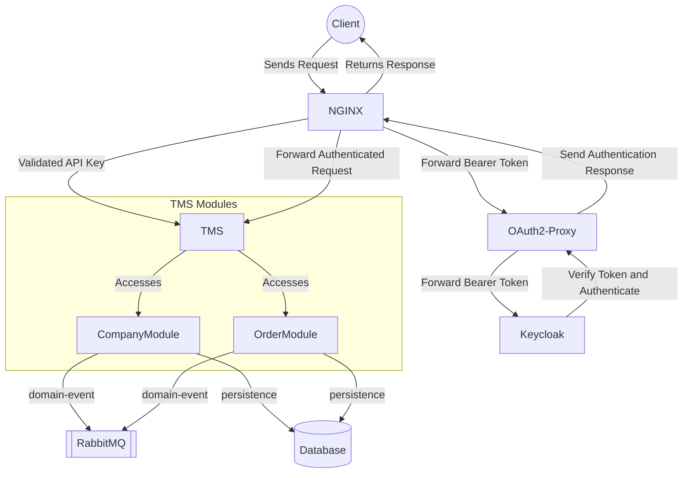
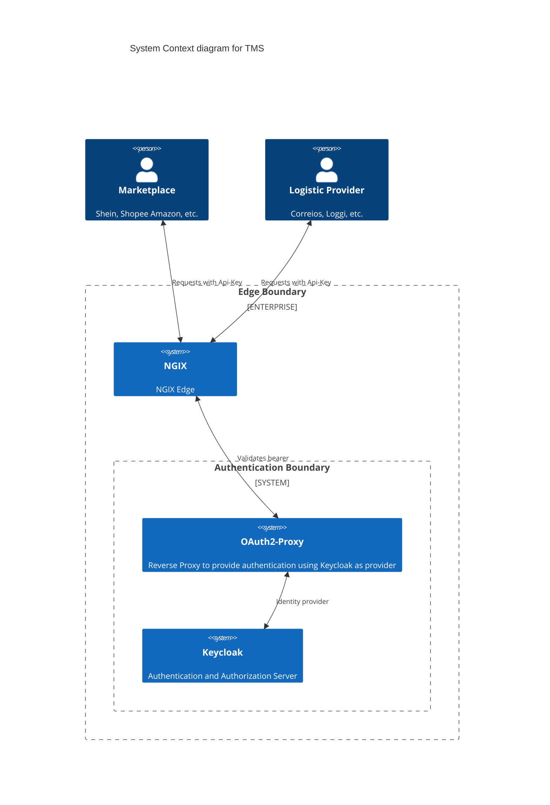

# Developer miscelanea 

## Environment Set-Up

### Tools
* [SdkMan](https://sdkman.io/)
* [Docker Engine](https://docs.docker.com/engine/install/ubuntu/)
* [Docker Compose](https://docs.docker.com/compose/)
* [Postman](https://www.postman.com/)
* [IntelliJ](https://www.jetbrains.com/pt-br/idea/)

#### IntelliJ Plugins
* [Mermaid](https://plugins.jetbrains.com/plugin/20146-mermaid)
* [EnvFile](https://plugins.jetbrains.com/plugin/7861-envfile)
* [Copilot](https://plugins.jetbrains.com/plugin/17718-github-copilot)

### Development
* [`java:21`](https://sdkman.io/usage)
* [`maven:3.9.7`](https://sdkman.io/sdks/#maven)

## High Level

## C4
