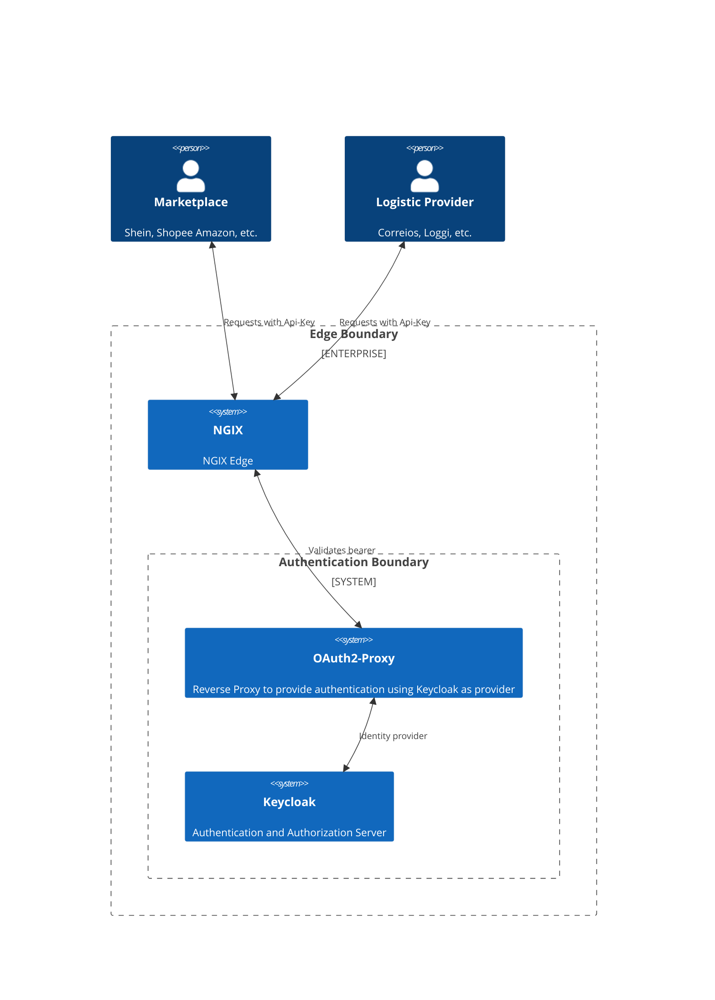

# Developer miscelanea 

## Environment Set-Up

### Tools
* [SdkMan](https://sdkman.io/)
* [Docker Engine](https://docs.docker.com/engine/install/ubuntu/)
* [Docker Compose](https://docs.docker.com/compose/)
* [Postman](https://www.postman.com/)
* [IntelliJ](https://www.jetbrains.com/pt-br/idea/)

#### IntelliJ Plugins
* [Mermaid](https://plugins.jetbrains.com/plugin/20146-mermaid)
* [Copilot](https://plugins.jetbrains.com/plugin/17718-github-copilot)

### Development
* [`java:21`](https://sdkman.io/usage)
* [`maven:3.9.7`](https://sdkman.io/sdks/#maven)

### Documentation
* [Mermaid](https://mermaid.js.org/intro/getting-started.html)

### Localhost Shortcuts

* [Minio](http://127.0.0.1:9001/login) 
  * tms-user - tms-password
* [RabbitMQ](http://127.0.0.1:15672/)
  * tms - bitnami
* [Keycloak](http://127.0.0.0:8000/) 
  * admin - password
* [Loki](http://127.0.0.0:3100/ready)
* [Grafana](http://127.0.0.0:3000/)
  * admin - admin

### Database Migrations

**Location:** `/infra/database/migration/`

**How to create a migration:**
1. Check existing migrations: `ls infra/database/migration/`
2. Create new file: `V{N+1}__{description}.sql` (e.g., `V7__add_field_to_table.sql`)
3. Write SQL migration (CREATE, ALTER, DROP, INDEX, etc.)
4. Run `docker compose up` - Flyway container applies automatically

**Examples:**
```sql
-- Add column
ALTER TABLE schema.table ADD COLUMN field_name UUID NOT NULL;

-- Create index
CREATE INDEX idx_table_field ON schema.table(field);
```

See `/doc/ai/prompts/new-migration.md` for complete guide.

### HTTP Request Files (Manual Testing)

**Location:** `/src/main/resources/{module}/request.http`

**Purpose:** Manual testing files for IntelliJ HTTP Client with variable storage

**Structure:**
```
src/main/resources/
├── company/request.http
├── shipmentorder/request.http
└── {module}/request.http
```

**Pattern:**
```http
@server = http://localhost:8080

### Create Resource
POST {{server}}/resources
Content-Type: application/json
Accept: application/json

{
  "field": "value"
}

> 

### Use Variable
GET {{server}}/resources/{{variableName}}
```

**Key Points:**
- ✅ Variables stored globally: ``
- ✅ Variables used with double braces: `{{variableName}}`
- ✅ Dynamic values: `{{$uuid}}`, `{{$timestamp}}`
- ✅ Multiple requests in same file, separated by `###`
- ✅ Execute sequentially to build test data chains

**Example Workflow (TMS):**
```http
### 1. Create company (Marketplace)
POST {{server}}/companies
{ "name": "Shein", "types": ["MARKETPLACE"] }
> 

### 2. Create shipper (Logistics Provider)
POST {{server}}/companies
{ "name": "Loggi", "types": ["LOGISTICS_PROVIDER"] }
> 

### 3. Create shipment order using both
POST {{server}}/shipmentorders
{
  "companyId": "{{companyId}}",
  "shipperId": "{{shipper}}",
  "externalId": "{{$uuid}}"
}
```

**When to Update:**
- ✅ New aggregate created → Add request.http to module
- ✅ New field added to DTO → Update request body
- ✅ New endpoint → Add request to relevant file
- ✅ Need to reference ID → Use global variable

**See Also:** Existing files in `src/main/resources/{company,shipmentorder}/request.http`

    - .cursorrules (critical for Cursor users)
    - .github/copilot-instructions.md (for GitHub Copilot)
    - .aidigestignore (reduce token usage)
    - .ai/prompts/ with templates
    - .ai/code-examples/ with complete patterns
    - docs/GLOSSARY.md (ubiquitous language)

## C4
### Context

