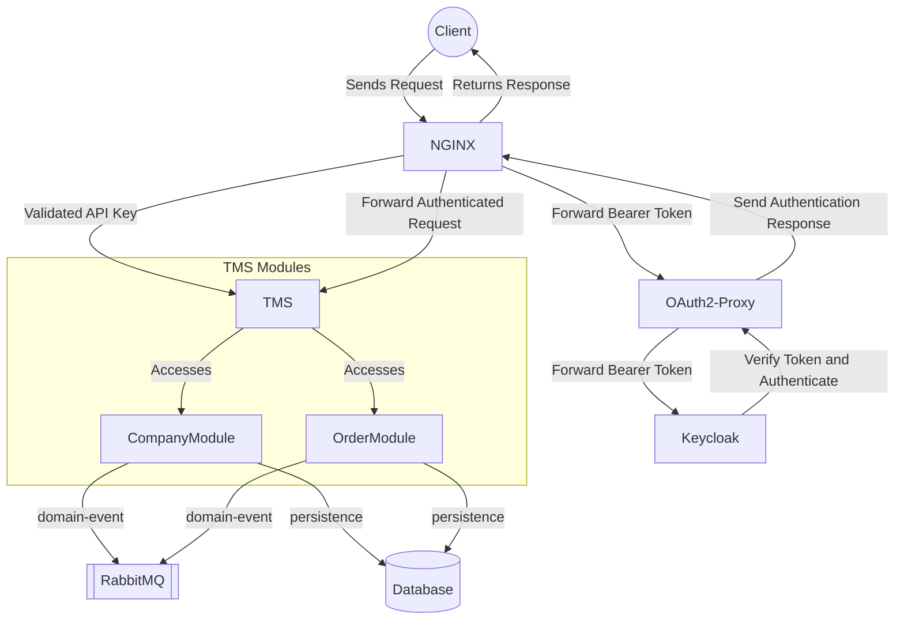

# TMS

## Overview
A Transportation Management System (TMS) designed to deliver key functionalities for efficient logistics and transportation operations:
- **Quotation**: Generate and manage transportation cost estimates for various services and routes.
- **Order Management**: Oversee and process transportation orders from initiation to completion, including order creation, tracking, and updates.
- **Volume Tracking**: Monitor and manage the volume of shipments, ensuring accurate tracking and reporting of cargo throughout its journey.
- **Integration Between Actors**: Facilitate seamless communication and data exchange between various stakeholders, such as shippers, carriers, and customers, to streamline operations and enhance coordination.

## High Level

## To Engineers
For more detailed and technical information, please refer to the [HELP.md](HELP.md) file.
