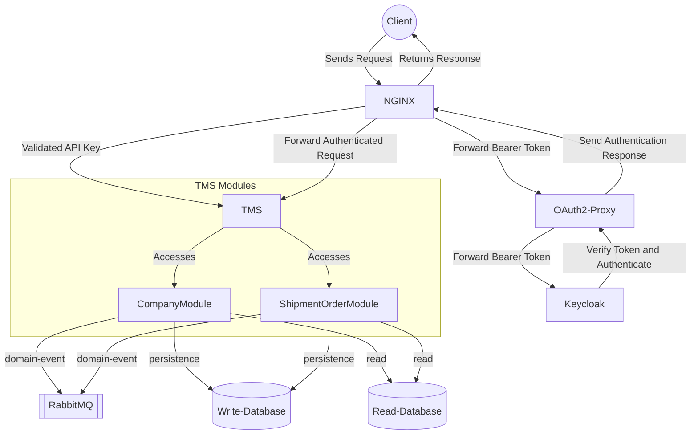

# TMS

A Transportation Management System that automates quotation, order orchestration and volume tracking to reduce freight costs and improve on-time delivery for shippers and carriers.

## Target customers

- Shippers with medium to high shipment frequency
- 3PLs and carriers needing centralized order orchestration
- Commercial teams that price and sell transport services

## Modules
- Company — onboarding customers and partners with business configuration
- Quotation — generate, compare and accept transport quotes
- Shipment order — creation, assignment, tracking, delivery confirmation
- Volume tracking — monitor capacity and utilization across time windows

## Database Migrations
Database schema changes are managed via Flyway migrations in `/infra/database/migration/`.
Migrations are applied automatically during `docker compose up`. See [HELP.md](HELP.md) for details.

## High Level

## Glossary
For more detailed and technical information, please refer to the [GLOSSARY.md](doc/ai/GLOSSARY.md) file.

## To Engineers
For more detailed and technical information, please refer to the [HELP.md](HELP.md) file.
