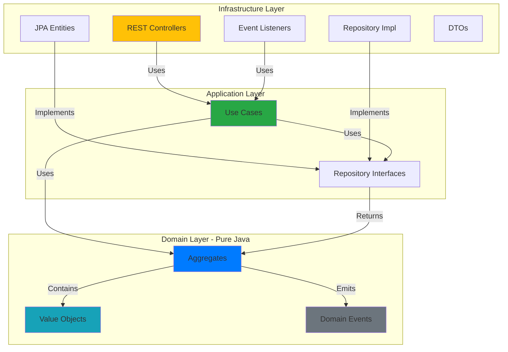
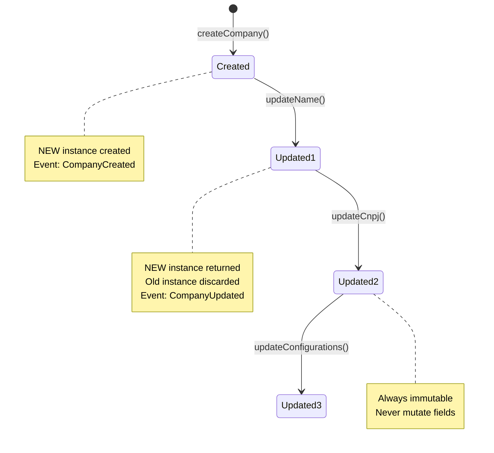
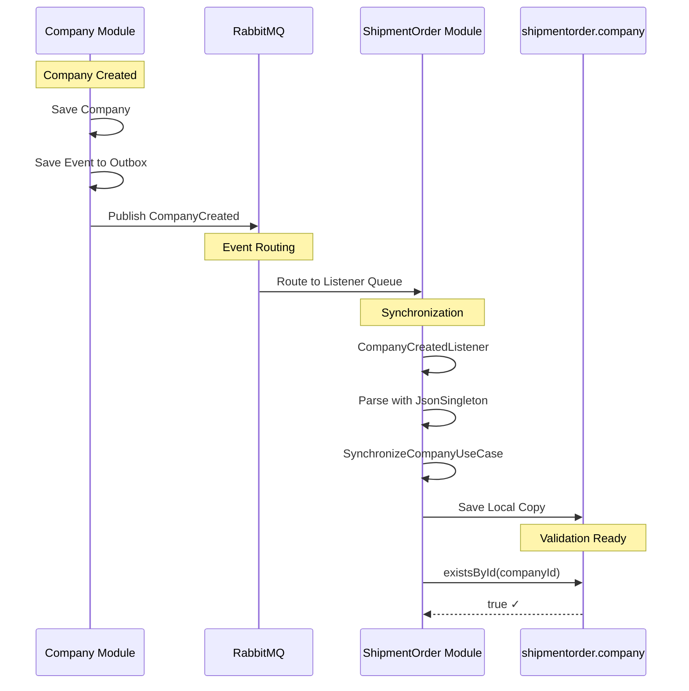

# TMS Architecture Guide

**For AI Assistants:** This document uses inverted pyramid structure - most critical information first.

---

## 🎯 TL;DR - Critical Rules (Read This First!)

### Absolute Requirements

1. **Domain objects are IMMUTABLE** - Update methods return NEW instances, never mutate
2. **Events placed in AGGREGATES** - Use `placeDomainEvent()` in aggregate methods, NOT in use cases
3. **CQRS annotations MANDATORY** - Every use case and controller must have `@Cqrs(DatabaseRole.WRITE or READ)`
4. **Modules communicate via EVENTS only** - No direct repository calls between modules
5. **One aggregate per transaction** - Maintain consistency within aggregate boundaries
6. **Repository handles outbox** - Domain events saved transactionally with aggregate

### Layer Boundaries (STRICT)



**Layer Rules:**

```
Domain Layer (domain/)
├─ ✅ Pure Java only
├─ ✅ Business logic
├─ ❌ NO Spring, JPA, Jackson, HTTP
└─ ❌ NO framework dependencies

Application Layer (application/)
├─ ✅ Use cases, repository interfaces
├─ ✅ Depends ONLY on domain
└─ ❌ NO HTTP, database, messaging

Infrastructure Layer (infrastructure/)
├─ ✅ ALL framework code here
├─ ✅ Controllers, JPA, DTOs, listeners
└─ ✅ Implements application interfaces
```

---

## 🗄️ Database Migrations

```mermaid
flowchart LR
    DEV[Developer] -->|Create| MIG[V{N}__description.sql]
    MIG -->|Place in| DIR[/infra/database/migration/]
    DIR -->|docker compose up| FLY[Flyway Container]
    FLY -->|Read migrations| FLY
    FLY -->|Apply in order| DB[(PostgreSQL)]
    DB -->|Track in| META[flyway_schema_history]
    
    style MIG fill:#e1f5e1
    style FLY fill:#fff3cd
    style DB fill:#d1ecf1
```

**Location:** `/infra/database/migration/`

**How It Works:**
1. Migrations are versioned SQL files in `/infra/database/migration/`
2. Named as `V{number}__{description}.sql` (e.g., `V7__add_shipper_to_shipment_order.sql`)
3. Flyway container applies migrations automatically during `docker compose up`
4. Migrations run in order (V1, V2, V3, ...)

**Creating a Migration:**

```bash
# 1. Check existing migrations to get next version number
ls infra/database/migration/
# Output: V1__create_schema.sql, V2__create_company.sql, ...V6__create_shipment_order_outbox.sql

# 2. Create new migration file
touch infra/database/migration/V7__add_field_to_table.sql

# 3. Write SQL migration
```

**Migration Examples:**

```sql
-- Add NOT NULL column
ALTER TABLE {schema}.{table} ADD COLUMN {field_name} UUID NOT NULL;

-- Add nullable column
ALTER TABLE {schema}.{table} ADD COLUMN {field_name} VARCHAR(255);

-- Create index
CREATE INDEX idx_{table}_{field} ON {schema}.{table}({field});

-- Modify column
ALTER TABLE {schema}.{table} ALTER COLUMN {field} TYPE VARCHAR(500);

-- Add constraint
ALTER TABLE {schema}.{table} ADD CONSTRAINT fk_{name} 
    FOREIGN KEY ({column}) REFERENCES {other_table}(id);
```

**Key Points:**
- ✅ Migrations run transactionally
- ✅ Applied automatically by Flyway during `docker compose up`
- ✅ Never modify existing migrations (create new ones for changes)
- ✅ Use descriptive names (what change, which table)
- ✅ Check existing migrations to understand table schemas

---

## 📦 Essential Patterns (Most Used)

### Pattern 1: Use Case (Application Layer)

**WRITE Operation:**
```java
@DomainService
@Cqrs(DatabaseRole.WRITE)
public class CreateCompanyUseCase implements UseCase<Input, Output> {
    
    private final CompanyRepository repository;

    @Override
    public Output execute(Input input) {
        // 1. Validate
        // 2. Create/load aggregate
        Company company = Company.createCompany(...);
        // 3. Persist (repository handles events)
        company = repository.create(company);
        // 4. Return output
        return new Output(company.getId().value());
    }

    public record Input(...) {}
    public record Output(...) {}
}
```

**READ Operation:**
```java
@DomainService
@Cqrs(DatabaseRole.READ)  // Different database!
public class GetCompanyByIdUseCase implements UseCase<Input, Output> {
    private final CompanyRepository repository;

    @Override
    public Output execute(Input input) {
        Company company = repository.getById(new CompanyId(input.id()))
                .orElseThrow(() -> new NotFoundException("Not found"));
        return new Output(company.getId().value(), company.getName());
    }

    public record Input(UUID id) {}
    public record Output(UUID id, String name) {}
}
```

**Key Points:**
- ✅ `@DomainService` + `@Cqrs(DatabaseRole)` required
- ✅ Input/Output as nested records
- ✅ One operation per use case
- ✅ Constructor injection only
- ✅ All parameters `final`

### Pattern 2: Value Objects (Domain Layer)

```java
@RestController
@RequestMapping("companies")
@Cqrs(DatabaseRole.WRITE)
public class CreateController {

    private final CreateCompanyUseCase useCase;
    private final DefaultRestPresenter presenter;
    private final RestUseCaseExecutor executor;

    @PostMapping
    public Object create(@RequestBody CreateCompanyDTO dto) {
        return executor
                .from(useCase)
                .withInput(dto)
                .mapOutputTo(CreateCompanyResponseDTO.class)
                .presentWith(output -> presenter.present(output, HttpStatus.CREATED.value()))
                .execute();
    }
}
```

**Key Points:**
- ✅ Zero business logic - only delegation
- ✅ Use `RestUseCaseExecutor` for orchestration
- ✅ Must have `@Cqrs` annotation matching use case

### Pattern 3: Immutable Aggregate (Domain Layer)

```java
public class Company extends AbstractAggregateRoot {

    private final CompanyId id;
    private final String name;
    private final Cnpj cnpj;

    // Private constructor
    private Company(CompanyId id, String name, Cnpj cnpj,
                   Set<AbstractDomainEvent> events, 
                   Map<String, Object> metadata) {
        super(new HashSet<>(events), new HashMap<>(metadata));
        // Validation
        if (id == null) throw new ValidationException("Invalid id");
        this.id = id;
        this.name = name;
        this.cnpj = cnpj;
    }

    // Factory method for creation
    public static Company createCompany(String name, String cnpj, ...) {
        Company company = new Company(
            CompanyId.unique(), name, new Cnpj(cnpj), 
            new HashSet<>(), new HashMap<>()
        );
        company.placeDomainEvent(new CompanyCreated(company.getId().value()));
        return company;
    }

    // Update returns NEW instance
    public Company updateName(String name) {
        if (this.name.equals(name)) return this;
        
        Company updated = new Company(
            this.id, name, this.cnpj,
            this.getDomainEvents(), this.getPersistentMetadata()
        );
        updated.placeDomainEvent(new CompanyUpdated(updated.getId().value(), "name", this.name, name));
        return updated;
    }

    // Getters only, NO setters
    public CompanyId getId() { return id; }
    public String getName() { return name; }
}
```

**Key Points:**
- ✅ ALWAYS immutable - updates return new instances
- ✅ Private constructor + public factory methods
- ✅ Domain events placed HERE, not in use cases
- ✅ Getters only, NO setters
- ✅ Use value objects for encapsulation



### Pattern 4: Value Objects (Domain Layer)

Value objects encapsulate domain primitives with validation.

**ID Value Object:**
```java
public record CompanyId(UUID value) {
    public CompanyId {
        if (value == null) {
            throw new ValidationException("Invalid value for CompanyId");
        }
    }

    public static CompanyId unique() {
        return new CompanyId(Id.unique());
    }

    public static CompanyId with(final UUID value) {
        return new CompanyId(value);
    }
}
```

**Validated String:**
```java
public record Cnpj(String value) {
    public Cnpj {
        if (value == null || !isValid(value)) {
            throw new ValidationException("Invalid CNPJ format");
        }
    }
    
    private static boolean isValid(String cnpj) {
        return cnpj != null && cnpj.matches("\\d{14}");
    }
}
```

**Map Value Object:**
```java
public record Configurations(Map<String, Object> value) {
    public Configurations {
        if (value == null || value.isEmpty()) {
            throw new ValidationException("Configuration cannot be null or empty");
        }
        value = Collections.unmodifiableMap(value);
    }

    public static Configurations with(final Map<String, Object> value) {
        return new Configurations(value);
    }
}
```

**Key Points:**
- ✅ Use Java records
- ✅ Validate in compact constructor
- ✅ Immutable (no setters)
- ✅ Factory methods (`unique()`, `with()`)
- ✅ Throw ValidationException for invalid values

**See:** `/doc/ai/prompts/value-objects.md` for complete guide

### Pattern 5: Eventual Consistency (Cross-Module)



When a module needs to validate references to another module's data.

**Steps:**
1. Create local table with JSONB
2. Create simplified aggregate with value objects
3. Create synchronize use case
4. Create event listeners (Created/Updated)
5. Add validation in existing use cases

**Example - ShipmentOrder validates Company exists:**

```java
// 1. Migration
CREATE TABLE shipmentorder.company (
    company_id UUID PRIMARY KEY,
    data JSONB NOT NULL
);

// 2. Domain Value Objects
public record CompanyId(UUID value) { /* ... */ }
public record CompanyData(Map<String, Object> value) { /* ... */ }

// 3. Simplified Aggregate
public class Company extends AbstractAggregateRoot {
    private final CompanyId companyId;
    private final CompanyData data;
    
    public static Company createCompany(UUID id, Map<String, Object> data) {
        return new Company(CompanyId.with(id), CompanyData.with(data), new HashSet<>());
    }
    
    public Company updateData(Map<String, Object> newData) {
        Map<String, Object> merged = new HashMap<>(this.data.value());
        merged.putAll(newData);
        return new Company(this.companyId, CompanyData.with(merged), this.getDomainEvents());
    }
}

// 4. Listener
@Component
@Cqrs(DatabaseRole.WRITE)
@Lazy(false)
public class CompanyCreatedListener {
    
    @RabbitListener(queues = "integration.shipmentorder.company.created")
    public void handle(final CompanyCreatedDTO event, ...) {
        // Parse using JsonSingleton
        @SuppressWarnings("unchecked")
        final Map<String, Object> data = JsonSingleton.getInstance()
                .fromJson(event.company(), Map.class);
        
        voidUseCaseExecutor
                .from(synchronizeCompanyUseCase)
                .withInput(new Input(event.companyId(), data))
                .execute();
    }
}

// 5. Validation
@Override
public Output execute(final Input input) {
    if (!companyRepository.existsById(input.companyId())) {
        throw new ValidationException("Company not found: " + input.companyId());
    }
    // ... create aggregate
}
```

**Key Points:**
- ✅ JSONB stores flexible data
- ✅ Value objects for type safety
- ✅ Handles create AND update events
- ✅ Validation before aggregate creation
- ✅ NO direct repository calls between modules

**See:** `/doc/ai/prompts/eventual-consistency.md` for complete guide

### Pattern 6: Event Listener (Infrastructure Layer)

```java
@Component
@Cqrs(DatabaseRole.WRITE)
@Lazy(false)
public class ShipmentOrderCreatedListener {
    
    private final VoidUseCaseExecutor executor;
    private final IncrementCounterUseCase useCase;

    @RabbitListener(queues = "integration.company.shipmentorder.created")
    public void handle(ShipmentOrderCreatedDTO dto, Message message, Channel channel) {
        executor
                .from(useCase)
                .withInput(new IncrementCounterUseCase.Input(dto.companyId()))
                .execute();
    }
}
```

**Key Points:**
- ✅ Modules communicate ONLY via events
- ✅ Use `@RabbitListener` for inter-module events
- ✅ Always `@Lazy(false)` to register at startup

---

## 🏗️ Architecture Overview

**TMS** is a modular monolith built with:
- **Domain-Driven Design (DDD)** - Aggregates, value objects, domain events
- **Hexagonal Architecture** - Domain (core) → Application (ports) → Infrastructure (adapters)
- **CQRS** - Separate read/write operations (different databases)
- **Event-Driven** - Modules communicate asynchronously via RabbitMQ
- **Spring Modulith** - Module boundary enforcement

### High-Level Flow

```
Client Request
    ↓
NGINX (API key) → OAuth2-Proxy (JWT) → TMS Application
    ↓
Controller (@Cqrs) → Use Case (@Cqrs) → Aggregate
    ↓
Repository → Save Aggregate + Events (same transaction)
    ↓
Outbox Publisher → RabbitMQ → Other Modules
```

### Module Structure

```
module/
├── domain/              # Pure Java, business logic
│   ├── {Aggregate}.java
│   ├── {ValueObject}.java
│   └── {DomainEvent}.java
│
├── application/         # Use cases, repository interfaces
│   ├── usecases/
│   └── repositories/
│
└── infrastructure/      # Framework code
    ├── rest/           # Controllers
    ├── dto/            # Data transfer objects
    ├── jpa/            # JPA entities
    ├── repositories/   # Repository implementations
    └── listener/       # Event listeners
```

---

## 🔑 Key Concepts

### Aggregates
- Consistency boundaries (e.g., `Company`, `ShipmentOrder`)
- All changes go through aggregate root
- Enforce business invariants
- Raise domain events
- Reference other aggregates by ID only

### Value Objects
- Immutable objects (Java records)
- Defined by attributes, not identity
- Examples: `CompanyId`, `Cnpj`, `Agreement`
- Contain validation logic

### Domain Events
- Past tense naming (e.g., `CompanyCreated`)
- Raised by aggregates when state changes
- Persisted to outbox table (transactional)
- Enable module decoupling

### CQRS Pattern
- Write operations: `@Cqrs(DatabaseRole.WRITE)` → write database
- Read operations: `@Cqrs(DatabaseRole.READ)` → read replica
- Currently both point to same PostgreSQL (can split later)

### Outbox Pattern
- Guarantees event delivery
- Flow: Aggregate → Repository saves entity + events → Outbox publisher → RabbitMQ
- Transactional consistency (events saved with aggregate)

---

## 📋 Common Operations

### Add New Operation to Existing Aggregate

1. Create use case → See [prompts/new-use-case.md](prompts/new-use-case.md)
2. Create controller → See [examples/complete-controller.md](examples/complete-controller.md)
3. Create DTOs (request/response)
4. Add tests

### Add Communication Between Modules

1. Define domain event in source module
2. Place event in aggregate (use `placeDomainEvent()`)
3. Create listener in target module → See [prompts/new-event-listener.md](prompts/new-event-listener.md)
4. Configure queue/binding in RabbitMQ
5. Test event flow

### Update Aggregate Field

1. Add update method that returns NEW instance
2. Place domain event if significant
3. Update JPA entity
4. Update use cases
5. Test immutability

---

## ⚠️ Anti-Patterns (DO NOT DO)

❌ **Mutable aggregates with setters**
```java
// WRONG
public void setName(String name) {
    this.name = name;
}
```

❌ **Framework dependencies in domain**
```java
// WRONG - domain layer
@Entity  // JPA annotation
public class Company { ... }
```

❌ **Business logic in controllers**
```java
// WRONG
@PostMapping
public Object create(@RequestBody DTO dto) {
    if (dto.cnpj() == null) { ... }  // Validation belongs in use case/domain
    Company company = new Company(...);  // Creation logic belongs in use case
}
```

❌ **Cross-module repository calls**
```java
// WRONG - in ShipmentOrder module
private final CompanyRepository companyRepository;  // Don't call other module's repositories
```

❌ **Domain events from use cases**
```java
// WRONG
public Output execute(Input input) {
    Company company = Company.createCompany(...);
    company = repository.create(company);
    eventPublisher.publish(new CompanyCreated(...));  // Event should be in aggregate
}
```

❌ **Omitting @Cqrs annotation**
```java
// WRONG
@DomainService  // Missing @Cqrs annotation
public class CreateCompanyUseCase { ... }
```

---

## 🔧 Technical Details

### Layer Architecture Details

#### Domain Layer (Inner Circle)
- **Pure business logic** - No framework dependencies
- Contains: Aggregates, Value Objects, Domain Events, Domain Exceptions
- Rules: No Spring, JPA, Jackson, or ANY framework

#### Application Layer (Middle Circle)
- **Orchestration** of business use cases
- Contains: Use Cases, Repository Interfaces, Presenters
- Rules: Depends only on domain, no infrastructure knowledge

#### Infrastructure Layer (Outer Circle)
- **Technical implementation**
- Contains: REST Controllers, JPA Entities, DTOs, Listeners, Repository Implementations
- Rules: Implements application interfaces, contains all Spring annotations

### CQRS Implementation

**Configuration:**
```yaml
datasource:
  write:
    url: jdbc:postgresql://${DB_WRITE_HOST}:${DB_WRITE_PORT}/${DB_WRITE_NAME}
  read:
    url: jdbc:postgresql://${DB_READ_HOST}:${DB_READ_PORT}/${DB_READ_NAME}

app:
  cqrs:
    mode: ${APP_CQRS_MODE}  # ENABLED, DISABLED, WRITE_ONLY, READ_ONLY
```

**Routing:** Annotation-based routing to correct datasource

### UUID v7 for IDs

```java
public record Id() {
    public static UUID unique() {
        return Generators.timeBasedEpochGenerator().generate();
    }
}
```

**Benefits:**
- Time-ordered (better database performance)
- No database roundtrip needed
- Sortable by creation time

**Reference:** See [/doc/adr/ADR-001-ID-Format.md](../adr/ADR-001-ID-Format.md)

### Event-Driven Architecture Flow

```
1. Aggregate places event in memory
   company.placeDomainEvent(new CompanyCreated(...));

2. Repository saves aggregate + events (same transaction)
   @Transactional
   public Company create(Company company) {
       jpaRepository.save(CompanyEntity.of(company));
       outboxGateway.save(company.getDomainEvents(), CompanyOutboxEntity.class);
       return company;
   }

3. Background publisher polls outbox and sends to RabbitMQ

4. Other modules listen via @RabbitListener
```

### Module Communication Rules

**✅ Correct:**
```java
// Module A: Company aggregate places event
company.placeDomainEvent(new CompanyCreated(...));

// Module B: ShipmentOrder listens to event
@RabbitListener(queues = "integration.shipmentorder.company.created")
public void handle(CompanyCreatedDTO dto) { ... }
```

**❌ Wrong:**
```java
// ShipmentOrder module calling Company repository directly
private final CompanyRepository companyRepository;  // WRONG!
```

---

## 🧪 Testing Strategy

### Test Levels

1. **Domain Tests** - Pure unit tests, no Spring context
2. **Use Case Tests** - Mock repositories (TODO: not yet fully implemented)
3. **Integration Tests** - Full Spring context with Testcontainers
4. **Modularity Tests** - Spring Modulith boundary verification

**Examples:** See [examples/testing-patterns.md](examples/testing-patterns.md)

---

## 📚 Additional Resources

### Full Documentation
- **Original Architecture (Full Detail):** [ARCHITECTURE_FULL.md](ARCHITECTURE_FULL.md)
- **Quick Reference:** [QUICK_REFERENCE.md](QUICK_REFERENCE.md)
- **Code Examples:** [examples/](examples/)
- **Creation Prompts:** [prompts/](prompts/)

### Related Docs
- **Codebase Context:** [CODEBASE_CONTEXT.md](CODEBASE_CONTEXT.md)
- **Glossary:** [GLOSSARY.md](GLOSSARY.md)
- **Architecture Decisions:** [../adr/](../adr/)
- **Technical Debt:** [../debt/DEBT.md](../debt/DEBT.md)

### GitHub Copilot
- **Auto-loaded Instructions:** [/.github/copilot-instructions.md](../../.github/copilot-instructions.md)

---

## 🎓 For AI Assistants

When generating code:

1. **Always respect layer boundaries** - Domain = pure Java only
2. **Follow use case pattern** - One operation per use case, annotated correctly
3. **Domain events in aggregates** - Never throw from use cases
4. **Immutability** - Update methods return new instances
5. **Testing** - Domain tests with no frameworks, integration tests with Testcontainers
6. **IDs** - Always use `Id.unique()` for new entities
7. **Transactions** - One transaction per use case execution

**When in doubt:** Check [QUICK_REFERENCE.md](QUICK_REFERENCE.md) or [examples/](examples/)

---

**Last Updated:** 2025-11-05

**Note:** This is the condensed version optimized for AI consumption. For complete details, see [ARCHITECTURE_FULL.md](ARCHITECTURE_FULL.md).
