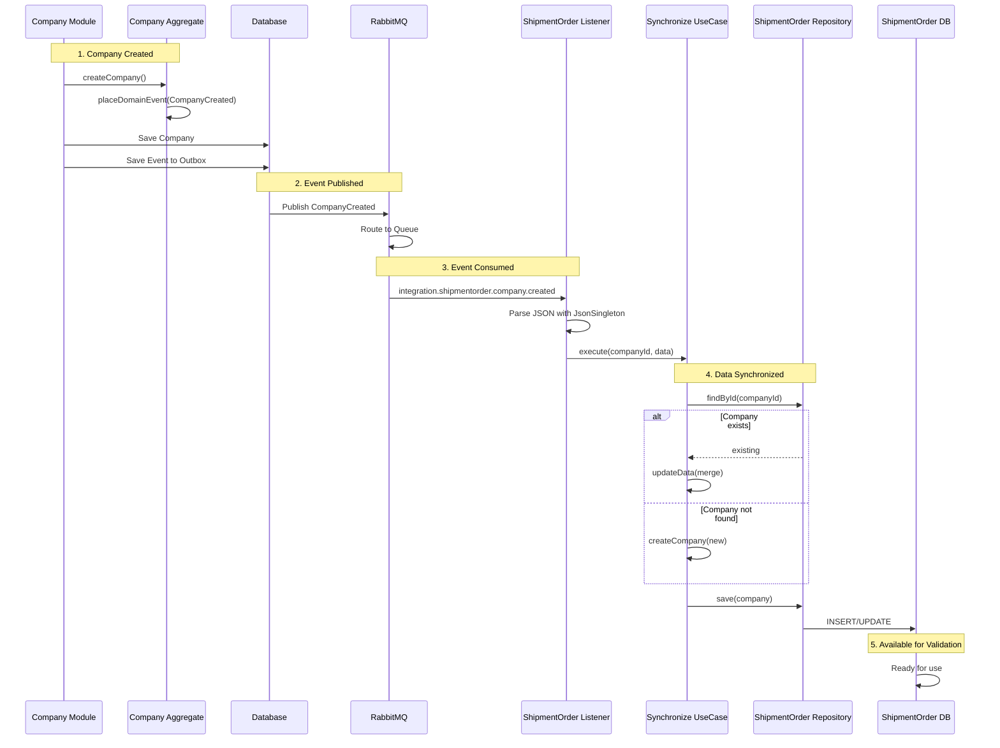
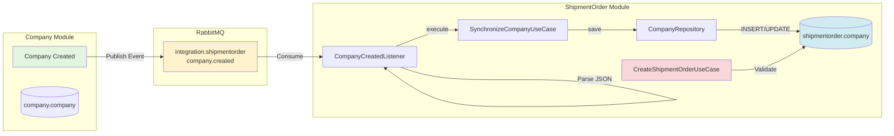

# Eventual Consistency Guide

## Purpose
Implement eventual consistency between modules using event-driven synchronization.

---

## When to Use

Use eventual consistency when:
- ✅ Module needs to validate references to other module's data
- ✅ Module needs read-only access to another module's data
- ✅ Strong consistency is NOT required
- ✅ You want to maintain module autonomy

**Example:** ShipmentOrder module needs to validate that Company exists before creating an order.

---

## Pattern Overview



**Flow Explanation:**

```
Source Module                           Target Module
─────────────                           ─────────────

1. Aggregate created/updated
   ↓
2. Domain event placed
   ↓
3. Event saved to outbox
   ↓
4. Published to RabbitMQ
                                        5. Listener receives event
                                           ↓
                                        6. Use case synchronizes data
                                           ↓
                                        7. Saved to local table
                                           ↓
                                        8. Available for validation!
```

---

## Implementation Steps

### Step 1: Create Migration for Local Table

**Location:** `/infra/database/migration/V{N}__create_{entity}_in_{target}_schema.sql`

```sql
-- Simple table with UUID + JSONB for flexible data
CREATE TABLE {target_schema}.{entity} (
    {entity}_id UUID PRIMARY KEY,
    data JSONB NOT NULL
);

-- GIN index for JSONB queries
CREATE INDEX idx_{entity}_data ON {target_schema}.{entity} USING GIN (data);
```

**Example:**
```sql
CREATE TABLE shipmentorder.company (
    company_id UUID PRIMARY KEY,
    data JSONB NOT NULL
);

CREATE INDEX idx_company_data_types ON shipmentorder.company USING GIN (data);
```

---

### Step 2: Create Value Objects (Domain Layer)

**{Entity}Id Value Object:**
```java
package br.com.logistics.tms.{module}.domain;

import br.com.logistics.tms.commons.domain.Id;
import br.com.logistics.tms.commons.domain.exception.ValidationException;
import java.util.UUID;

public record {Entity}Id(UUID value) {

    public {Entity}Id {
        if (value == null) {
            throw new ValidationException("Invalid value for {Entity}Id");
        }
    }

    public static {Entity}Id unique() {
        return new {Entity}Id(Id.unique());
    }

    public static {Entity}Id with(final String value) {
        return new {Entity}Id(Id.with(value));
    }

    public static {Entity}Id with(final UUID value) {
        return new {Entity}Id(value);
    }
}
```

**{Entity}Data Value Object:**
```java
package br.com.logistics.tms.{module}.domain;

import br.com.logistics.tms.commons.domain.exception.ValidationException;
import java.util.Collections;
import java.util.Map;

public record {Entity}Data(Map<String, Object> value) {

    public {Entity}Data {
        if (value == null || value.isEmpty()) {
            throw new ValidationException("{Entity} data cannot be null or empty");
        }

        value = Collections.unmodifiableMap(value);
    }

    public static {Entity}Data with(final Map<String, Object> value) {
        return new {Entity}Data(value);
    }
}
```

---

### Step 3: Create Simplified Aggregate (Domain Layer)

```java
package br.com.logistics.tms.{module}.domain;

import br.com.logistics.tms.commons.domain.AbstractAggregateRoot;
import br.com.logistics.tms.commons.domain.AbstractDomainEvent;
import br.com.logistics.tms.commons.domain.exception.ValidationException;
import java.util.*;

public class {Entity} extends AbstractAggregateRoot {

    private final {Entity}Id {entity}Id;
    private final {Entity}Data data;

    private {Entity}(final {Entity}Id {entity}Id,
                     final {Entity}Data data,
                     final Set<AbstractDomainEvent> domainEvents) {
        super(new HashSet<>(domainEvents), new HashMap<>());

        if ({entity}Id == null) throw new ValidationException("Invalid {entity}Id");
        if (data == null) throw new ValidationException("Invalid data");

        this.{entity}Id = {entity}Id;
        this.data = data;
    }

    public static {Entity} create{Entity}(final UUID {entity}Id, final Map<String, Object> data) {
        return new {Entity}({Entity}Id.with({entity}Id), {Entity}Data.with(data), new HashSet<>());
    }

    public {Entity} updateData(final Map<String, Object> newData) {
        final Map<String, Object> mergedData = new HashMap<>(this.data.value());
        mergedData.putAll(newData);
        return new {Entity}(this.{entity}Id, {Entity}Data.with(mergedData), this.getDomainEvents());
    }

    public {Entity}Id get{Entity}Id() {
        return {entity}Id;
    }

    public {Entity}Data getData() {
        return data;
    }
}
```

**Key Points:**
- ✅ Uses value objects for encapsulation
- ✅ Immutable (updates return new instance)
- ✅ NO domain events for synchronization (already synced from source)
- ✅ Simple: just ID + flexible data

---

### Step 4: Create Repository (Application Layer)

**Interface:**
```java
package br.com.logistics.tms.{module}.application.repositories;

import br.com.logistics.tms.{module}.domain.{Entity};
import br.com.logistics.tms.{module}.domain.{Entity}Id;
import java.util.Optional;
import java.util.UUID;

public interface {Entity}Repository {

    {Entity} save({Entity} {entity});

    Optional<{Entity}> findById({Entity}Id {entity}Id);

    boolean existsById(UUID {entity}Id);
}
```

---

### Step 5: Create Synchronize Use Case (Application Layer)

```java
package br.com.logistics.tms.{module}.application.usecases;

import br.com.logistics.tms.commons.application.annotation.Cqrs;
import br.com.logistics.tms.commons.application.annotation.DatabaseRole;
import br.com.logistics.tms.commons.application.annotation.DomainService;
import br.com.logistics.tms.commons.application.usecases.UseCase;
import br.com.logistics.tms.{module}.application.repositories.{Entity}Repository;
import br.com.logistics.tms.{module}.domain.{Entity};
import br.com.logistics.tms.{module}.domain.{Entity}Id;
import java.util.Map;
import java.util.UUID;

@DomainService
@Cqrs(DatabaseRole.WRITE)
public class Synchronize{Entity}UseCase implements UseCase<Synchronize{Entity}UseCase.Input, Synchronize{Entity}UseCase.Output> {

    private final {Entity}Repository {entity}Repository;

    public Synchronize{Entity}UseCase(final {Entity}Repository {entity}Repository) {
        this.{entity}Repository = {entity}Repository;
    }

    @Override
    public Output execute(final Input input) {
        final {Entity} {entity} = {entity}Repository.findById({Entity}Id.with(input.{entity}Id()))
                .map(existing -> existing.updateData(input.data()))
                .orElseGet(() -> {Entity}.create{Entity}(input.{entity}Id(), input.data()));

        final {Entity} saved = {entity}Repository.save({entity});

        return new Output(saved.get{Entity}Id().value(), saved.getData().value());
    }

    public record Input(UUID {entity}Id, Map<String, Object> data) {}

    public record Output(UUID {entity}Id, Map<String, Object> data) {}
}
```

**Key Points:**
- ✅ Handles both creation AND updates
- ✅ Merges data on updates
- ✅ WRITE operation

---

### Step 6: Create JPA Entity (Infrastructure Layer)

```java
package br.com.logistics.tms.{module}.infrastructure.jpa.entities;

import br.com.logistics.tms.{module}.domain.{Entity};
import br.com.logistics.tms.{module}.infrastructure.config.{Module}Schema;
import jakarta.persistence.*;
import lombok.AllArgsConstructor;
import lombok.Data;
import lombok.NoArgsConstructor;
import org.hibernate.annotations.JdbcTypeCode;
import org.hibernate.type.SqlTypes;
import java.io.Serializable;
import java.util.HashMap;
import java.util.Map;
import java.util.UUID;

@Entity
@Table(name = "{entity}", schema = {Module}Schema.{MODULE}_SCHEMA)
@Data
@NoArgsConstructor
@AllArgsConstructor
public class {Entity}Entity implements Serializable {

    @Id
    @Column(name = "{entity}_id", nullable = false)
    private UUID {entity}Id;

    @JdbcTypeCode(SqlTypes.JSON)
    @Column(name = "data", nullable = false)
    private Map<String, Object> data;

    public static {Entity}Entity from(final {Entity} {entity}) {
        return new {Entity}Entity(
                {entity}.get{Entity}Id().value(),
                {entity}.getData().value()
        );
    }

    public {Entity} toDomain() {
        return {Entity}.create{Entity}(
                this.{entity}Id,
                this.data != null ? new HashMap<>(this.data) : new HashMap<>()
        );
    }
}
```

**Key Points:**
- ✅ Use `@JdbcTypeCode(SqlTypes.JSON)` for JSONB mapping
- ✅ NOT `@Type(JsonBinaryType.class)` (old Hibernate)
- ✅ Map between domain and entity using value objects

---

### Step 7: Create Repository Implementation (Infrastructure Layer)

```java
package br.com.logistics.tms.{module}.infrastructure.repositories;

import br.com.logistics.tms.{module}.application.repositories.{Entity}Repository;
import br.com.logistics.tms.{module}.domain.{Entity};
import br.com.logistics.tms.{module}.domain.{Entity}Id;
import br.com.logistics.tms.{module}.infrastructure.jpa.entities.{Entity}Entity;
import br.com.logistics.tms.{module}.infrastructure.jpa.repositories.{Entity}JpaRepository;
import org.springframework.stereotype.Repository;
import java.util.Optional;
import java.util.UUID;

@Repository
public class {Entity}RepositoryImpl implements {Entity}Repository {

    private final {Entity}JpaRepository {entity}JpaRepository;

    public {Entity}RepositoryImpl(final {Entity}JpaRepository {entity}JpaRepository) {
        this.{entity}JpaRepository = {entity}JpaRepository;
    }

    @Override
    public {Entity} save(final {Entity} {entity}) {
        {Entity}Entity entity = {Entity}Entity.from({entity});
        entity = {entity}JpaRepository.save(entity);
        return entity.toDomain();
    }

    @Override
    public Optional<{Entity}> findById(final {Entity}Id {entity}Id) {
        return {entity}JpaRepository.findById({entity}Id.value())
                .map({Entity}Entity::toDomain);
    }

    @Override
    public boolean existsById(final UUID {entity}Id) {
        return {entity}JpaRepository.existsById({entity}Id);
    }
}
```

---

### Step 8: Create DTOs for Events (Infrastructure Layer)

**Created Event DTO:**
```java
package br.com.logistics.tms.{module}.infrastructure.dto;

import java.time.Instant;
import java.util.UUID;

public record {Entity}CreatedDTO(
        UUID domainEventId,
        UUID {entity}Id,
        String {entity},  // JSON string from source module
        Instant occurredOn,
        String aggregateId,
        String type,
        String module) {
}
```

**Updated Event DTO:**
```java
package br.com.logistics.tms.{module}.infrastructure.dto;

import java.time.Instant;
import java.util.UUID;

public record {Entity}UpdatedDTO(
        UUID domainEventId,
        UUID {entity}Id,
        String property,
        String oldValue,
        String newValue,
        Instant occurredOn,
        String aggregateId,
        String type,
        String module) {
}
```

---

### Step 9: Create Event Listeners (Infrastructure Layer)

**Created Event Listener:**
```java
package br.com.logistics.tms.{module}.infrastructure.listener;

import br.com.logistics.tms.commons.application.annotation.Cqrs;
import br.com.logistics.tms.commons.application.annotation.DatabaseRole;
import br.com.logistics.tms.commons.infrastructure.json.JsonSingleton;
import br.com.logistics.tms.commons.infrastructure.usecases.VoidUseCaseExecutor;
import br.com.logistics.tms.{module}.application.usecases.Synchronize{Entity}UseCase;
import br.com.logistics.tms.{module}.infrastructure.dto.{Entity}CreatedDTO;
import com.rabbitmq.client.Channel;
import org.springframework.amqp.core.Message;
import org.springframework.amqp.rabbit.annotation.RabbitListener;
import org.springframework.context.annotation.Lazy;
import org.springframework.stereotype.Component;
import java.util.HashMap;
import java.util.Map;

@Component
@Cqrs(DatabaseRole.WRITE)
@Lazy(false)
public class {Entity}CreatedListener {

    private final VoidUseCaseExecutor voidUseCaseExecutor;
    private final Synchronize{Entity}UseCase synchronize{Entity}UseCase;

    public {Entity}CreatedListener(final VoidUseCaseExecutor voidUseCaseExecutor,
                                   final Synchronize{Entity}UseCase synchronize{Entity}UseCase) {
        this.voidUseCaseExecutor = voidUseCaseExecutor;
        this.synchronize{Entity}UseCase = synchronize{Entity}UseCase;
    }

    @RabbitListener(queues = "integration.{target}.{source}.{entity}.created")
    public void handle(final {Entity}CreatedDTO event, final Message message, final Channel channel) {
        try {
            // Parse JSON string from source module using JsonSingleton
            @SuppressWarnings("unchecked")
            final Map<String, Object> {entity}Data = JsonSingleton.getInstance()
                    .fromJson(event.{entity}(), Map.class);

            // Extract only needed fields
            final Map<String, Object> data = new HashMap<>();
            data.put("field1", {entity}Data.get("field1"));
            data.put("field2", {entity}Data.get("field2"));
            // Add other fields as needed

            voidUseCaseExecutor
                    .from(synchronize{Entity}UseCase)
                    .withInput(new Synchronize{Entity}UseCase.Input(event.{entity}Id(), data))
                    .execute();
        } catch (Exception e) {
            throw new RuntimeException("Failed to synchronize {entity}: " + event.{entity}Id(), e);
        }
    }
}
```

**Updated Event Listener:**
```java
package br.com.logistics.tms.{module}.infrastructure.listener;

import br.com.logistics.tms.commons.application.annotation.Cqrs;
import br.com.logistics.tms.commons.application.annotation.DatabaseRole;
import br.com.logistics.tms.commons.infrastructure.usecases.VoidUseCaseExecutor;
import br.com.logistics.tms.{module}.application.usecases.Synchronize{Entity}UseCase;
import br.com.logistics.tms.{module}.infrastructure.dto.{Entity}UpdatedDTO;
import com.rabbitmq.client.Channel;
import org.springframework.amqp.core.Message;
import org.springframework.amqp.rabbit.annotation.RabbitListener;
import org.springframework.context.annotation.Lazy;
import org.springframework.stereotype.Component;
import java.util.HashMap;
import java.util.Map;

@Component
@Cqrs(DatabaseRole.WRITE)
@Lazy(false)
public class {Entity}UpdatedListener {

    private final VoidUseCaseExecutor voidUseCaseExecutor;
    private final Synchronize{Entity}UseCase synchronize{Entity}UseCase;

    public {Entity}UpdatedListener(final VoidUseCaseExecutor voidUseCaseExecutor,
                                   final Synchronize{Entity}UseCase synchronize{Entity}UseCase) {
        this.voidUseCaseExecutor = voidUseCaseExecutor;
        this.synchronize{Entity}UseCase = synchronize{Entity}UseCase;
    }

    @RabbitListener(queues = "integration.{target}.{source}.{entity}.updated")
    public void handle(final {Entity}UpdatedDTO event, final Message message, final Channel channel) {
        // Update specific property
        final Map<String, Object> data = new HashMap<>();
        data.put(event.property(), event.newValue());

        voidUseCaseExecutor
                .from(synchronize{Entity}UseCase)
                .withInput(new Synchronize{Entity}UseCase.Input(event.{entity}Id(), data))
                .execute();
    }
}
```

---

### Step 10: Update RabbitMQ Configuration

**File:** `/infra/rabbitmq/definitions.json`

Add queues:
```json
{
  "name": "integration.{target}.{source}.{entity}.created",
  "vhost": "/",
  "durable": true,
  "auto_delete": false,
  "arguments": {
    "x-message-ttl": 86400000
  }
},
{
  "name": "integration.{target}.{source}.{entity}.updated",
  "vhost": "/",
  "durable": true,
  "auto_delete": false,
  "arguments": {
    "x-message-ttl": 86400000
  }
}
```

Add bindings:
```json
{
  "source": "tms.events",
  "vhost": "/",
  "destination": "integration.{target}.{source}.{entity}.created",
  "destination_type": "queue",
  "routing_key": "integration.{source}.{Entity}Created",
  "arguments": {}
},
{
  "source": "tms.events",
  "vhost": "/",
  "destination": "integration.{target}.{source}.{entity}.updated",
  "destination_type": "queue",
  "routing_key": "integration.{source}.{Entity}Updated",
  "arguments": {}
}
```

---

### Step 11: Add Validation to Use Cases

Update the use case that needs validation:

```java
@DomainService
@Cqrs(DatabaseRole.WRITE)
public class Create{Aggregate}UseCase implements UseCase<Input, Output> {

    private final {Aggregate}Repository {aggregate}Repository;
    private final {Entity}Repository {entity}Repository;  // ← Inject

    public Create{Aggregate}UseCase(final {Aggregate}Repository {aggregate}Repository,
                                    final {Entity}Repository {entity}Repository) {
        this.{aggregate}Repository = {aggregate}Repository;
        this.{entity}Repository = {entity}Repository;
    }

    @Override
    public Output execute(final Input input) {
        // Validate referenced entity exists
        if (!{entity}Repository.existsById(input.{entity}Id())) {
            throw new ValidationException("{Entity} not found: " + input.{entity}Id());
        }

        // Create aggregate
        final {Aggregate} {aggregate} = {aggregate}Repository.create(
            {Aggregate}.create{Aggregate}(input.{entity}Id(), ...)
        );

        return new Output({aggregate}.get{Aggregate}Id().value());
    }

    public record Input(UUID {entity}Id, ...) {}
    public record Output(UUID {aggregate}Id) {}
}
```

---

## Real Example (ShipmentOrder → Company)



**Files Created:**

1. **Migration:** `V8__create_company_in_shipmentorder_schema.sql`
2. **Domain:**
   - `CompanyId.java` (value object)
   - `CompanyData.java` (value object)
   - `Company.java` (simplified aggregate)
3. **Application:**
   - `CompanyRepository.java` (interface)
   - `SynchronizeCompanyUseCase.java`
4. **Infrastructure:**
   - `CompanyEntity.java` (JPA)
   - `CompanyJpaRepository.java`
   - `CompanyRepositoryImpl.java`
   - `CompanyCreatedDTO.java`
   - `CompanyUpdatedDTO.java`
   - `CompanyCreatedListener.java`
   - `CompanyUpdatedListener.java`
5. **Validation:** Updated `CreateShipmentOrderUseCase.java`
6. **Config:** Updated `definitions.json`

---

## Best Practices

✅ **DO:**
- Use value objects for type safety
- Store only needed data in JSONB
- Handle both create AND update events
- Use `@JdbcTypeCode(SqlTypes.JSON)` for JSONB
- Validate before creating aggregates
- Use GIN indexes for JSONB queries
- All variables `final`
- Listener delegates to use case

❌ **DON'T:**
- Don't replicate entire aggregate
- Don't use direct repository calls across modules
- Don't require strong consistency
- Don't modify source module data
- Don't emit new domain events (already synced)

---

## Troubleshooting

**Listener not receiving events:**
- Check `@Lazy(false)` on listener
- Verify queue exists in RabbitMQ
- Check routing key matches

**Data not synchronized:**
- Check listener logs for errors
- Verify JSON parsing
- Check field names match source

**Validation fails:**
- Check events published before creating aggregate
- Verify eventual consistency timing
- Check existsById implementation

---

## Related Documentation

- [Event-Driven Communication](../examples/event-driven-communication.md)
- [New Event Listener](new-event-listener.md)
- [RabbitMQ Configuration](/infra/rabbitmq/definitions.json)
