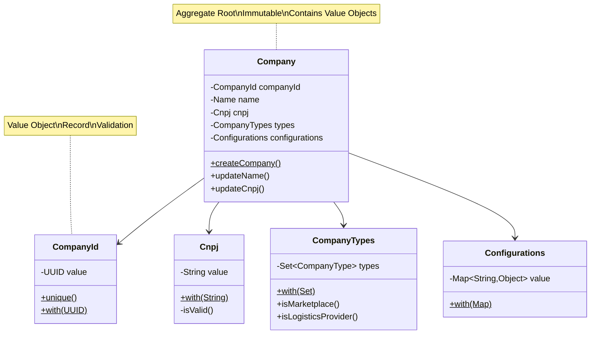

# Value Objects Guide

## Purpose
Create value objects to encapsulate and validate domain primitives.

---

## What is a Value Object?

A value object:
- ✅ Represents a descriptive aspect of the domain
- ✅ Is immutable
- ✅ Has no identity (compared by value, not reference)
- ✅ Encapsulates validation logic
- ✅ Self-validates in constructor

**Examples:** Email, Money, Address, CompanyId, Cnpj, Configurations

---

## When to Create Value Objects

Create value objects when:
- ✅ A primitive (String, UUID, int) has domain meaning
- ✅ Validation rules exist for the value
- ✅ Multiple fields logically belong together
- ✅ The value is conceptually immutable

**Good candidates:**
- IDs (CompanyId, OrderId)
- Identifiers (CNPJ, CPF, Email)
- Complex values (Address, Money, Configuration)
- Collections with rules (CompanyTypes, Conditions)

---

## TMS Pattern: Use Java Records

**Why Records?**
- ✅ Immutable by default
- ✅ Compact syntax
- ✅ Auto-generated equals/hashCode/toString
- ✅ Validation in compact constructor
- ✅ Perfect for value objects

---

## Patterns

### Pattern 1: Simple ID Value Object

```java
package br.com.logistics.tms.{module}.domain;

import br.com.logistics.tms.commons.domain.Id;
import br.com.logistics.tms.commons.domain.exception.ValidationException;
import java.util.UUID;

public record {Entity}Id(UUID value) {

    public {Entity}Id {
        if (value == null) {
            throw new ValidationException("Invalid value for {Entity}Id");
        }
    }

    public static {Entity}Id unique() {
        return new {Entity}Id(Id.unique());
    }

    public static {Entity}Id with(final String value) {
        return new {Entity}Id(Id.with(value));
    }

    public static {Entity}Id with(final UUID value) {
        return new {Entity}Id(value);
    }
}
```

**Key Points:**
- Compact constructor validates (no body needed if just validation)
- `unique()` - Generate new UUID v7
- `with(String)` - Parse from string
- `with(UUID)` - Wrap existing UUID

**Example:**
```java
public record CompanyId(UUID value) {
    public CompanyId {
        if (value == null) {
            throw new ValidationException("Invalid value for CompanyId");
        }
    }

    public static CompanyId unique() {
        return new CompanyId(Id.unique());
    }

    public static CompanyId with(final String value) {
        return new CompanyId(Id.with(value));
    }

    public static CompanyId with(final UUID value) {
        return new CompanyId(value);
    }
}
```

---

### Pattern 2: Validated String Value Object

```java
package br.com.logistics.tms.{module}.domain;

import br.com.logistics.tms.commons.domain.exception.ValidationException;

public record {ValueObject}(String value) {

    public {ValueObject} {
        if (value == null || !isValid(value)) {
            throw new ValidationException("Invalid {ValueObject} format");
        }
    }

    private static boolean isValid(String value) {
        // Validation logic
        return value != null && value.matches("regex-pattern");
    }

    public static {ValueObject} with(final String value) {
        return new {ValueObject}(value);
    }
}
```

**Example - CNPJ:**
```java
public record Cnpj(String value) {
    
    public Cnpj {
        if (value == null || !isValid(value)) {
            throw new ValidationException("Invalid CNPJ format");
        }
    }
    
    private static boolean isValid(String cnpj) {
        return cnpj != null && cnpj.matches("\\d{14}");
    }

    public static Cnpj with(final String value) {
        return new Cnpj(value);
    }
}
```

---

### Pattern 3: Map/Collection Value Object

```java
package br.com.logistics.tms.{module}.domain;

import br.com.logistics.tms.commons.domain.exception.ValidationException;
import java.util.Collections;
import java.util.Map;

public record {ValueObject}(Map<String, Object> value) {

    public {ValueObject} {
        if (value == null || value.isEmpty()) {
            throw new ValidationException("{ValueObject} cannot be null or empty");
        }

        // Make immutable
        value = Collections.unmodifiableMap(value);
    }

    public static {ValueObject} with(final Map<String, Object> value) {
        return new {ValueObject}(value);
    }
}
```

**Example - Configurations:**
```java
public record Configurations(Map<String, Object> value) {

    public Configurations {
        if (value == null || value.isEmpty()) {
            throw new ValidationException("Configuration cannot be null or empty");
        }

        value = Collections.unmodifiableMap(value);
    }

    public static Configurations with(final Map<String, Object> value) {
        return new Configurations(value);
    }
}
```

**Example - CompanyData (for eventual consistency):**
```java
public record CompanyData(Map<String, Object> value) {

    public CompanyData {
        if (value == null || value.isEmpty()) {
            throw new ValidationException("Company data cannot be null or empty");
        }

        value = Collections.unmodifiableMap(value);
    }

    public static CompanyData with(final Map<String, Object> value) {
        return new CompanyData(value);
    }
}
```

---

### Pattern 4: Multi-Field Value Object

```java
package br.com.logistics.tms.{module}.domain;

import br.com.logistics.tms.commons.domain.exception.ValidationException;

public record {ValueObject}(Type field1, Type field2, Type field3) {

    public {ValueObject} {
        if (field1 == null) {
            throw new ValidationException("Invalid field1");
        }
        if (field2 == null || field2.isBlank()) {
            throw new ValidationException("Invalid field2");
        }
        // Validate other fields
    }

    public static {ValueObject} with(Type field1, Type field2, Type field3) {
        return new {ValueObject}(field1, field2, field3);
    }
}
```

**Example - Money:**
```java
public record Money(BigDecimal amount, Currency currency) {

    public Money {
        if (amount == null || amount.compareTo(BigDecimal.ZERO) < 0) {
            throw new ValidationException("Amount must be non-negative");
        }
        if (currency == null) {
            throw new ValidationException("Currency is required");
        }
    }

    public static Money of(BigDecimal amount, Currency currency) {
        return new Money(amount, currency);
    }

    public Money add(Money other) {
        if (!this.currency.equals(other.currency)) {
            throw new ValidationException("Cannot add different currencies");
        }
        return new Money(this.amount.add(other.amount), this.currency);
    }
}
```

---

### Pattern 5: Collection with Business Rules

```java
package br.com.logistics.tms.{module}.domain;

import br.com.logistics.tms.commons.domain.exception.ValidationException;
import java.util.Collections;
import java.util.HashSet;
import java.util.Set;

public record {ValueObject}(Set<Type> types) {

    public {ValueObject} {
        if (types == null || types.isEmpty()) {
            throw new ValidationException("{ValueObject} cannot be empty");
        }

        // Make immutable
        types = Collections.unmodifiableSet(new HashSet<>(types));
    }

    public static {ValueObject} with(final Set<Type> types) {
        return new {ValueObject}(types);
    }

    public boolean contains(Type type) {
        return types.contains(type);
    }
}
```

**Example - CompanyTypes:**
```java
public record CompanyTypes(Set<CompanyType> types) {

    public CompanyTypes {
        if (types == null || types.isEmpty()) {
            throw new ValidationException("Company must have at least one type");
        }

        types = Collections.unmodifiableSet(new HashSet<>(types));
    }

    public static CompanyTypes with(final Set<CompanyType> types) {
        return new CompanyTypes(types);
    }

    public boolean isMarketplace() {
        return types.contains(CompanyType.MARKETPLACE);
    }

    public boolean isLogisticsProvider() {
        return types.contains(CompanyType.LOGISTICS_PROVIDER);
    }
}
```

---

## Using Value Objects in Aggregates



```java
public class {Aggregate} extends AbstractAggregateRoot {

    private final {Aggregate}Id {aggregate}Id;
    private final {ValueObject1} {value1};
    private final {ValueObject2} {value2};

    private {Aggregate}(final {Aggregate}Id {aggregate}Id,
                        final {ValueObject1} {value1},
                        final {ValueObject2} {value2},
                        final Set<AbstractDomainEvent> domainEvents,
                        final Map<String, Object> persistentMetadata) {
        super(new HashSet<>(domainEvents), new HashMap<>(persistentMetadata));

        if ({aggregate}Id == null) throw new ValidationException("Invalid {aggregate}Id");
        if ({value1} == null) throw new ValidationException("Invalid {value1}");
        if ({value2} == null) throw new ValidationException("Invalid {value2}");

        this.{aggregate}Id = {aggregate}Id;
        this.{value1} = {value1};
        this.{value2} = {value2};
    }

    public static {Aggregate} create{Aggregate}(String param1, String param2) {
        final {Aggregate} {aggregate} = new {Aggregate}(
                {Aggregate}Id.unique(),
                {ValueObject1}.with(param1),
                {ValueObject2}.with(param2),
                new HashSet<>(),
                new HashMap<>()
        );
        {aggregate}.placeDomainEvent(new {Aggregate}Created(...));
        return {aggregate};
    }

    // Update returns NEW instance
    public {Aggregate} update{Value1}(String new{Value1}) {
        if (this.{value1}.value().equals(new{Value1})) return this;

        final {Aggregate} updated = new {Aggregate}(
                this.{aggregate}Id,
                {ValueObject1}.with(new{Value1}),
                this.{value2},
                this.getDomainEvents(),
                this.getPersistentMetadata()
        );
        updated.placeDomainEvent(new {Aggregate}Updated(...));
        return updated;
    }

    // Getters return value objects
    public {Aggregate}Id get{Aggregate}Id() {
        return {aggregate}Id;
    }

    public {ValueObject1} get{Value1}() {
        return {value1};
    }
}
```

---

## Mapping Value Objects in JPA

```java
@Entity
@Table(name = "{table}", schema = {Module}Schema.{MODULE}_SCHEMA)
public class {Entity}Entity {

    @Id
    @Column(name = "{entity}_id")
    private UUID {entity}Id;  // Store primitive

    @Column(name = "{field1}")
    private String {field1};  // Store primitive

    @JdbcTypeCode(SqlTypes.JSON)
    @Column(name = "{field2}")
    private Map<String, Object> {field2};  // Store primitive

    public static {Entity}Entity from(final {Aggregate} {aggregate}) {
        return new {Entity}Entity(
                {aggregate}.get{Aggregate}Id().value(),      // Extract from value object
                {aggregate}.get{Field1}().value(),           // Extract from value object
                {aggregate}.get{Field2}().value()            // Extract from value object
        );
    }

    public {Aggregate} toDomain() {
        return {Aggregate}.reconstruct(
                {Aggregate}Id.with(this.{entity}Id),         // Wrap in value object
                {ValueObject1}.with(this.{field1}),          // Wrap in value object
                {ValueObject2}.with(this.{field2})           // Wrap in value object
        );
    }
}
```

---

## Best Practices

✅ **DO:**
- Use records for value objects
- Validate in compact constructor
- Make fields `final`
- Use `Collections.unmodifiableX` for collections
- Provide factory methods (`with`, `of`, `unique`)
- Throw `ValidationException` for invalid values
- Compare by value (records do this automatically)

❌ **DON'T:**
- Don't add identity to value objects
- Don't make value objects mutable
- Don't use setters
- Don't expose mutable collections
- Don't add business logic beyond validation

---

## Common Value Objects in TMS

| Value Object | Purpose | Module |
|--------------|---------|--------|
| `CompanyId` | Company identifier | company, shipmentorder |
| `Cnpj` | Brazilian tax ID | company |
| `Configurations` | Configuration map | company |
| `CompanyTypes` | Company type set | company |
| `CompanyData` | Synchronized data | shipmentorder |
| `ShipmentOrderId` | Order identifier | shipmentorder |
| `AgreementId` | Agreement identifier | company |

---

## Examples from TMS

### CompanyId (ID Value Object)
```java
public record CompanyId(UUID value) {
    public CompanyId {
        if (value == null) {
            throw new ValidationException("Invalid value for CompanyId");
        }
    }

    public static CompanyId unique() {
        return new CompanyId(Id.unique());
    }

    public static CompanyId with(final UUID value) {
        return new CompanyId(value);
    }
}
```

### Cnpj (Validated String)
```java
public record Cnpj(String value) {
    public Cnpj {
        if (value == null || !isValid(value)) {
            throw new ValidationException("Invalid CNPJ format");
        }
    }
    
    private static boolean isValid(String cnpj) {
        return cnpj != null && cnpj.matches("\\d{14}");
    }
}
```

### Configurations (Map)
```java
public record Configurations(Map<String, Object> value) {
    public Configurations {
        if (value == null || value.isEmpty()) {
            throw new ValidationException("Configuration cannot be null or empty");
        }
        value = Collections.unmodifiableMap(value);
    }

    public static Configurations with(final Map<String, Object> value) {
        return new Configurations(value);
    }
}
```

### CompanyTypes (Set with Rules)
```java
public record CompanyTypes(Set<CompanyType> types) {
    public CompanyTypes {
        if (types == null || types.isEmpty()) {
            throw new ValidationException("Company must have at least one type");
        }
        types = Collections.unmodifiableSet(new HashSet<>(types));
    }

    public boolean isMarketplace() {
        return types.contains(CompanyType.MARKETPLACE);
    }
}
```

---

## Related Documentation

- [Complete Aggregate Example](../examples/complete-aggregate.md)
- [New Aggregate Guide](new-aggregate.md)
- [Domain Layer Patterns](../ARCHITECTURE.md)
